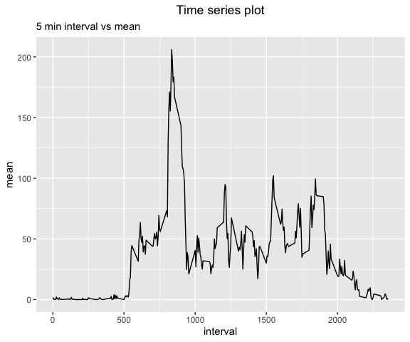

## Loading required packages


```r
if(!require(tidyverse)){
  install.packages("tidyverse")
  require(tidyverse)
}
```

```
## Loading required package: tidyverse
```

```
## ── Attaching packages ─────────────────────────────────────── tidyverse 1.3.2 ──
## ✔ ggplot2 3.4.0      ✔ purrr   1.0.1 
## ✔ tibble  3.1.8      ✔ dplyr   1.0.10
## ✔ tidyr   1.3.0      ✔ stringr 1.5.0 
## ✔ readr   2.1.3      ✔ forcats 0.5.2 
## ── Conflicts ────────────────────────────────────────── tidyverse_conflicts() ──
## ✖ dplyr::filter() masks stats::filter()
## ✖ dplyr::lag()    masks stats::lag()
```

```r
if(!require(lubridate)){
  install.packages("lubridate")
  require(lubridate)
}
```

```
## Loading required package: lubridate
## 
## Attaching package: 'lubridate'
## 
## The following objects are masked from 'package:base':
## 
##     date, intersect, setdiff, union
```

## Loading and preprocessing the data

> Show any code that is needed to
>
> 1.  Load the data (i.e. read.csv())
>
> 2.  Process/transform the data (if necessary) into a format suitable for your analysis

### Load the data (i.e. read.csv())


```r
data <- read.csv(unz("activity.zip","activity.csv"),header = TRUE)
```

### Process/transform the data (if necessary) into a format suitable for your analysis

OK. Check the data


```r
str(data)
```

```
## 'data.frame':	17568 obs. of  3 variables:
##  $ steps   : int  NA NA NA NA NA NA NA NA NA NA ...
##  $ date    : chr  "2012-10-01" "2012-10-01" "2012-10-01" "2012-10-01" ...
##  $ interval: int  0 5 10 15 20 25 30 35 40 45 ...
```

There are 17568 entries. The date column seems to be automatically interpreted. Is it done correctly?


```r
str(data$date)
```

```
##  chr [1:17568] "2012-10-01" "2012-10-01" "2012-10-01" "2012-10-01" ...
```

Date is in chr format.


```r
data$date <- ymd(data$date)
str(data$date)
```

```
##  Date[1:17568], format: "2012-10-01" "2012-10-01" "2012-10-01" "2012-10-01" "2012-10-01" ...
```

OK, we have the correct format


```r
head(data)
```

```
##   steps       date interval
## 1    NA 2012-10-01        0
## 2    NA 2012-10-01        5
## 3    NA 2012-10-01       10
## 4    NA 2012-10-01       15
## 5    NA 2012-10-01       20
## 6    NA 2012-10-01       25
```

There are NAs in the beginning


```r
tail(data)
```

```
##       steps       date interval
## 17563    NA 2012-11-30     2330
## 17564    NA 2012-11-30     2335
## 17565    NA 2012-11-30     2340
## 17566    NA 2012-11-30     2345
## 17567    NA 2012-11-30     2350
## 17568    NA 2012-11-30     2355
```

There are NAs at the end too.

## What is mean total number of steps taken per day?

> For this part of the assignment, you can ignore the missing values in the dataset.
>
> 1.  Calculate the total number of steps taken per day
>
> 2.  If you do not understand the difference between a histogram and a barplot, research the difference between them. Make a histogram of the total number of steps taken each day
>
> 3.  Calculate and report the mean and median of the total number of steps taken per day

### Calculate the total number of steps taken per day


```r
dailysum <- data %>% 
  group_by(date) %>% 
  summarise (sum = sum(steps, na.rm=TRUE))
```

### Make a histogram of the total number of steps taken each day

This gives us an idea of how many steps are generally taken per day in record. Completely idle days like 0 steps are very common. Apart from that, around 10000 steps is quite common.


```r
ggplot(dailysum, aes(x=sum,  na.rm = TRUE)) + geom_histogram(breaks = seq(0,25000, by=1000), na.rm = TRUE)
```

<!-- -->

### Calculate and report the mean and median of the total number of steps taken per day


```r
summary(dailysum)
```

```
##       date                 sum       
##  Min.   :2012-10-01   Min.   :    0  
##  1st Qu.:2012-10-16   1st Qu.: 6778  
##  Median :2012-10-31   Median :10395  
##  Mean   :2012-10-31   Mean   : 9354  
##  3rd Qu.:2012-11-15   3rd Qu.:12811  
##  Max.   :2012-11-30   Max.   :21194
```

The median value is 10395, the mean is 9354 steps.

## What is the average daily activity pattern?

> 1.  Make a time series plot (i.e. type = "l") of the 5-minute interval (x-axis) and the average number of steps taken, averaged across all days (y-axis)
>
> 2.  Which 5-minute interval, on average across all the days in the dataset, contains the maximum number of steps?

### Make a time series plot (i.e.type = "l") of the 5-minute interval (x-axis) and the average number of steps taken, averaged across all days (y-axis)

For this, we calculate the means specific to each interval. Thus, group_by(interval).


```r
interval_means <- data %>% 
  group_by(interval) %>% 
  summarise(mean = mean(steps,na.rm=TRUE))
```

Now, we can plot this time series plot with interval in x-axis and mean steps pertaining to each interval in y-axis


```r
ggplot(interval_means, aes(y=mean, x=interval))+
  geom_line()+
  ggtitle(label="Time series plot", subtitle="5 min interval vs mean")+
  theme(plot.title = element_text(hjust = 0.5))
```

<!-- -->

### Which 5-minute interval, on average across all the days in the dataset, contains the maximum number of steps?

We use the max function


```r
interval_means[interval_means$mean == max(interval_means$mean),]
```

```
## # A tibble: 1 × 2
##   interval  mean
##      <int> <dbl>
## 1      835  206.
```

The interval 835 has the maximum mean value of 206.1698 steps. Steps are integers, which gives \~ 206 steps.

## Imputing missing values

> *Note that there are a number of days/intervals where there are missing values (coded as NA). The presence of missing days may introduce bias into some calculations or summaries of the data.*
>
> 1.  *Calculate and report the total number of missing values in the dataset (i.e. the total number of rows with NA)*
>
> 2.  *Devise a strategy for filling in all of the missing values in the dataset. The strategy does not need to be sophisticated. For example, you could use the mean/median for that day, or the mean for that 5-minute interval, etc.*
>
> 3.  *Create a new dataset that is equal to the original dataset but with the missing data filled in.*
>
> 4.  *Make a histogram of the total number of steps taken each day and Calculate and report the **mean** and **median** total number of steps taken per day. Do these values differ from the estimates from the first part of the assignment? What is the impact of imputing missing data on the estimates of the total daily number of steps?*

### Calculate and report the total number of missing values in the dataset (i.e. the total number of rows with NA)

Let us sum up the number of NAs and not NAs in the data


```r
sum(is.na(data$steps))
```

```
## [1] 2304
```

```r
sum(!is.na(data$steps))
```

```
## [1] 15264
```

So there are 2304 NAs and 15264 not NA values in steps

## Devise a strategy for filling in all of the missing values in the dataset.

To get rid of NAs we can replace them with the mean value of the interval it belongs to. Using the dplyr functions from tidyverse, we can group all values belonging to an interval, and replace all NAs with the mean of the non-na values in that interval We will call this new data table 'data_impute'. Since the value is number of steps, the fill values must be integers, so the mean value is **rounded**.

### Create a new dataset that is equal to the original dataset but with the missing data filled in.


```r
data_impute <- data %>% 
  group_by(interval) %>% 
  mutate_at(vars(steps), 
            ~replace_na(., round(mean(., na.rm = TRUE)))
            )
```

OK, so how many NA and non-NA values we have in the new data_impute?


```r
sum(is.na(data_impute$steps))
```

```
## [1] 0
```

```r
sum(!is.na(data_impute$steps))
```

```
## [1] 17568
```

Imputed data has no NAs and a full complement of 17568 values for steps

### Make a histogram of the total number of steps taken each day

To make the histogram, we need to take sums for steps corresponding to each day


```r
dailysum_impute <- data_impute %>% 
  group_by(date) %>% 
  summarise (sum = sum(steps, na.rm=TRUE))
```

Now we can plot the histogram


```r
ggplot(dailysum_impute, aes(x=sum)) +
  geom_histogram(breaks = seq(0,25000, by=1000))
```

<!-- -->


```r
summary(dailysum_impute)
```

```
##       date                 sum       
##  Min.   :2012-10-01   Min.   :   41  
##  1st Qu.:2012-10-16   1st Qu.: 9819  
##  Median :2012-10-31   Median :10762  
##  Mean   :2012-10-31   Mean   :10766  
##  3rd Qu.:2012-11-15   3rd Qu.:12811  
##  Max.   :2012-11-30   Max.   :21194
```

The median is 10762 and mean is 10766. The median and mean are now close and the distribution is less skewed. We can see that the 0 values

## Are there differences in activity patterns between weekdays and weekends?

> 1.  *Create a new factor variable in the dataset with two levels -- "weekday" and "weekend" indicating whether a given date is a weekday or weekend day.*
>
> 2.  *Make a panel plot containing a time series plot (i.e. type = "l"type = "l") of the 5-minute interval (x-axis) and the average number of steps taken, averaged across all weekday days or weekend days (y-axis). See the README file in the GitHub repository to see an example of what this plot should look like using simulated data.*

### Create a new factor variable in the dataset with two levels -- "weekday" and "weekend" indicating whether a given date is a weekday or weekend day.


```r
weekday_or_end <- function(day) { ifelse(day=="Saturday" | day=="Sunday","Weekend","Weekday") }
```


```r
data_impute <- mutate(data_impute,dayweek = as.factor(weekday_or_end(weekdays(date))))
```

The new data_impute function now has a dayweek column which has two factors : Weekday and Weekend. To verify, check the below command.


```r
names(data_impute)
```

```
## [1] "steps"    "date"     "interval" "dayweek"
```

```r
str(data_impute$dayweek)
```

```
##  Factor w/ 2 levels "Weekday","Weekend": 1 1 1 1 1 1 1 1 1 1 ...
```

### Make a panel plot containing a time series plot (i.e. type = "l"type = "l") of the 5-minute interval (x-axis) and the average number of steps taken, averaged across all weekday days or weekend days (y-axis).


```r
timeseries <- data_impute %>% 
  group_by(dayweek,interval) %>% 
  summarise (mean = mean(steps, na.rm=TRUE))
```

```
## `summarise()` has grouped output by 'dayweek'. You can override using the
## `.groups` argument.
```


```r
g <- ggplot(timeseries, aes(x=interval, y=mean))+
  facet_grid(dayweek~.)+
  geom_line()+
  ggtitle("Average steps in Weekdays and Weekends")+
  theme(plot.title = element_text(hjust = 0.5))
print(g)
```

<!-- -->

# Thanks
